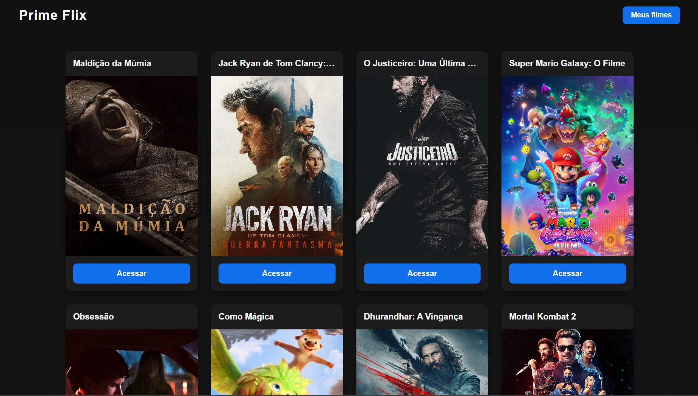
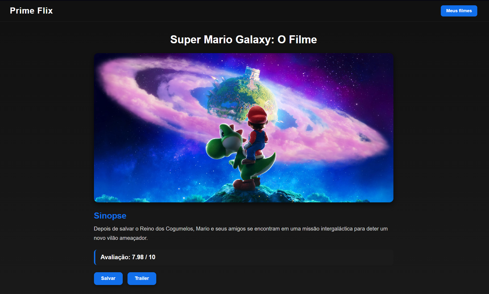

# 🎬 PrimeFlix

O **PrimeFlix** é uma aplicação web desenvolvida com React que consome dados da API do TMDB para listar filmes em destaque, visualizar detalhes e permitir que usuários salvem seus filmes favoritos localmente.

O projeto foi criado com foco em prática de integração com APIs reais, organização de componentes, gerenciamento de rotas e desenvolvimento de interfaces responsivas utilizando tecnologias modernas do ecossistema React.

---

# 🚀 Tecnologias Utilizadas

- React
- Vite
- JavaScript
- React Router DOM
- Axios
- React Toastify
- CSS Modules

---

# ✨ Funcionalidades

✅ Listagem de filmes utilizando a API do TMDB  
✅ Página de detalhes do filme  
✅ Sistema de favoritos  
✅ Aba "Meus Filmes"  
✅ Remoção de filmes salvos  
✅ Redirecionamento para trailer no YouTube  
✅ Layout responsivo  
✅ Notificações utilizando React Toastify  
✅ Tela de carregamento durante requisições da API  
✅ Navegação entre páginas com React Router DOM

---

# 🎥 Funcionamento do Trailer

Ao clicar no botão de trailer, o sistema redireciona automaticamente o usuário para uma pesquisa no YouTube no seguinte formato:

```txt
{Nome do filme} trailer
```

---

# 🛠️ Instalação

```bash
npm install
npm run dev
```

---

# 📦 Dependências Utilizadas

```bash
npm install react-router-dom axios react-toastify
```

---

# 🧠 Conceitos Aplicados

O projeto foi desenvolvido utilizando boas práticas de organização e componentização no React.

### 🔹 Axios + API

O arquivo `Api.jsx` utiliza `axios.create` para configurar a URL base da API do TMDB, facilitando as requisições e deixando o código mais limpo e reutilizável.

### 🔹 React Router DOM

O sistema utiliza rotas para navegação entre páginas como:

* Home
* Detalhes do Filme
* Favoritos
* Página de erro

### 🔹 LocalStorage

Os filmes favoritos são armazenados localmente utilizando `localStorage`, permitindo que os dados permaneçam salvos mesmo após atualizar a página.

### 🔹 Vite

O projeto foi criado utilizando o Vite, proporcionando:

* Inicialização rápida
* Melhor performance
* Hot Reload mais eficiente
* Build otimizada

---

# 📁 Estrutura do Projeto

```txt
src/
├── assets
│   ├── fotosite1.png
│   ├── fotosite2.png
│   └── PrimeFlixVideo.gif
│
├── components
│   └── Header
│       ├── index.jsx
│       └── style.module.css
│
├── pages
│   ├── Erro
│   │   ├── index.jsx
│   │   └── style.module.css
│   │
│   ├── Favoritos
│   │   ├── index.jsx
│   │   └── style.module.css
│   │
│   ├── Filme
│   │   ├── index.jsx
│   │   └── style.module.css
│   │
│   └── Home
│       ├── index.jsx
│       └── style.module.css
│
├── Services
│   └── Api.jsx
│
├── App.jsx
├── main.jsx
├── routes.jsx
└── style.css
```

---

# 🎥 Demonstração

## 🎬 Preview da Aplicação


---

## 📸 Screenshots





---

# 👨‍💻 Autor

## Lucas Melo

LinkedIn:
[https://www.linkedin.com/in/lucas-melo-631289264/](https://www.linkedin.com/in/lucas-melo-631289264/)
